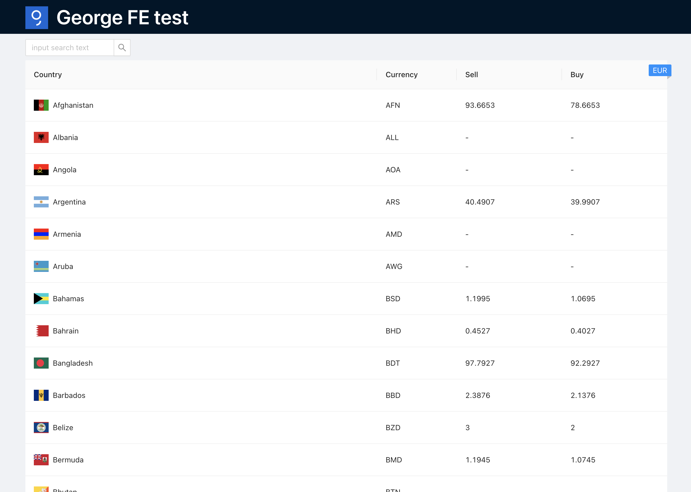

#  George FX Test App

This project was created as an assignment before the second round of the interview process for the position of FE developer.

The task was to create a small application that displays the currency exchange rates.

The application is simple and that's why I chose a simple tech stack.

This project was bootstrapped with [Create React App](https://github.com/facebook/create-react-app).

For UI I chose [Ant Design](https://ant.design/), because it is easy to work with and contains basic components with high quality API. I missed a clear way how to extend the component styles, on the other hand, the developer can choose the way that suits for a project.
Since I assumed that I would have to modify the component styles only minimally, I chose inline styles so that I wouldn't have to set anything up and so that development would be easy.

I chose [Axios](https://axios-http.com/) for data fetching, for the reason that axios provides an easy to use API.

Since the application does not work with a lot of data and contains relatively simple business logic, I decided not to use a third-party library for state management and stay in the React and use the React state and context.

For the tests I decided to focus on e2e tests with the [Cypress](https://www.cypress.io/), because this way I am able to test it completely. For some parts of the business logic I wrote unit tests.

Things I haven't time to implement, but I had planned:

1. Use virtual scroll for exchange range table (https://github.com/bvaughn/react-window)
2. Polling
3. Use the GitHub actions for CI

## Available Scripts

In the project directory, you can run:

### `npm start`

Runs the app in the development mode.\
Open [http://localhost:3000](http://localhost:3000) to view it in the browser.

The page will reload if you make edits.\
You will also see any lint errors in the console.

### `npm test`

Launches the test runner in the interactive watch mode.\
See the section about [running tests](https://facebook.github.io/create-react-app/docs/running-tests) for more information.

### `npm run e2e`

Launches the Cyprees test runner and use the browsers for tests.
For more information check [Cypress docs](https://docs.cypress.io/guides/guides/command-line#cypress-open)

_Don't forget to run the app on port 3000 before run cypress_

### `npm run build`

Builds the app for production to the `build` folder.\
It correctly bundles React in production mode and optimizes the build for the best performance.

The build is minified and the filenames include the hashes.\
Your app is ready to be deployed!

See the section about [deployment](https://facebook.github.io/create-react-app/docs/deployment) for more information.

### `npm run eject`

**Note: this is a one-way operation. Once you `eject`, you can’t go back!**

If you aren’t satisfied with the build tool and configuration choices, you can `eject` at any time. This command will remove the single build dependency from your project.

Instead, it will copy all the configuration files and the transitive dependencies (webpack, Babel, ESLint, etc) right into your project so you have full control over them. All of the commands except `eject` will still work, but they will point to the copied scripts so you can tweak them. At this point you’re on your own.

You don’t have to ever use `eject`. The curated feature set is suitable for small and middle deployments, and you shouldn’t feel obligated to use this feature. However we understand that this tool wouldn’t be useful if you couldn’t customize it when you are ready for it.
